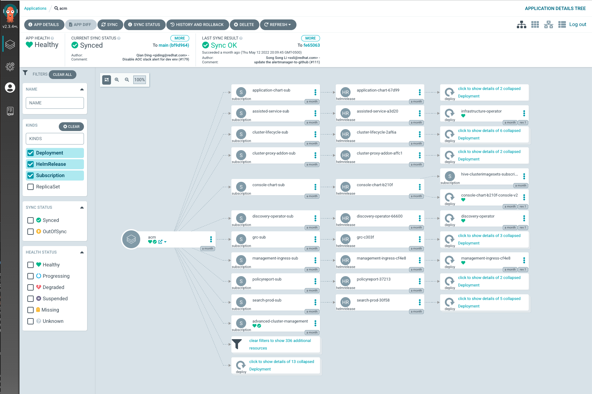

# Fleet Health

## Determining ACM Health

- The Red Hat Advanced Cluster Management product is deliverated as an Operator Hub Operator.
- The Operator is deployed with a Subscription defintion.
- The instance Operand manifest is applied, requiring only a reference to an image pull secret.
- In the 2.4 release, we can verify the state of the ACM deployment by monitoring the status output of the multiclusterhub CR. The multiclusterhub CR reflects the state of the `MulticlusterHub Operator`, or **MCH**. If all the ACM components are successfully deployed, then the final status of the multiclusterhub CR will be **Running**. A state of `Progressing` indicates that the install process has not yet completed. A `Blocked` status indicates that the install or upgrade process was interrupted due to missing requirement or conflict that prevents the process from starting.
- In the 2.5 release, the cluster-lifecycle subcomponent was separated out as a standalone product component called `Multicluster Engine`, with a short name short name of **MCE**. When we deploy RHACM 2.5, both product component operators will be deployed. The `Multiclusterhub` operator and the `Multicluster Engine` operator. The **MCH** will refect the same status as before, with **Running** indicating sucessful completion of install or upgrade. The **MCE** will show a status of **Available** to indicate that its install/upgrade processing has completed successfully.

!!! note

    

```mermaid
graph LR
    MCH[MCH] -->|Subscribe| APPSUB_A(APPSUB_A)
    MCH[MCH] -->|Subscribe| APPSUB_B(APPSUB_B)
    MCH[MCH] -->|Subscribe| APPSUB_C(APPSUB_C)
    MCH[MCH] -->|Subscribe| APPSUB_D(APPSUB_D)
    MCH[MCH] -->|Subscribe| APPSUB_E(APPSUB_E)
    APPSUB_A[APPSUB_A] --> HELM_A[HELM_A]
    APPSUB_B[APPSUB_B] --> HELM_B[HELM_B]
    APPSUB_C[APPSUB_C] --> HELM_C[HELM_C]
    APPSUB_D[APPSUB_D] --> HELM_D[HELM_D]
    APPSUB_E[APPSUB_E] --> HELM_E[HELM_E]
    
    MCE[MCE]
    
    
    %% B --> C{Let me think}
    %% C -->|One| D[Laptop]
    %% C -->|Two| E[iPhone]
    %% C -->|Three| F[fa:fa-car Car]
```

- The MCH and MCE reflect the deploy time status of RHACM. We can derive the instantious pod state weither they are running or crashing, and historically if the pods have a history of restarting. From this we cannot tell if the internal function are nominal.
- To determine ACM Heath from metrics and utilization, the Openshift Monitoriing components can be inspected. If ACM Observability is enabled, then the ACM Hub (local-cluster) is aggregated with the rest of the fleet data and available in the aggregate Grafana dashboard.

### What is needed

- We need to understand the API latency on each ACM subcomponent.
- We need to be able to measure ACM to determine SLO.
- The fact that ACM is a workload running on top of Openshift, knowing the k8s apiserver SLO, does not necessarily reflect the SLO for the ACM component api.
- There is no specific dashboard that shows data for the ACM components. Up to now, we manually create the view, without ever persisting the views to a reusable custom dashboard.

## Determine Fleet Health

- In order to review the fleet health or status, we can inspect ACM and Observability Grafana dashboard.
- The ACM cluster view indicates the current state of imported clusters, if they are `Ready`, or not `Ready`.
- The Goverance and Application views indicates the state of policy compliance and applications respectiveliy, across the fleet.
- Finally, the Observability dashboard aggregates metrics data from the fleet in a single pane of glass.

!!! note

    There is one important notion that our work has highlighted. ACM as a system does not represent the source of truth clusters in the enterprise. We can import clusters from different cloud providers and even on-prem sources, but those providers will be the source of truth of their domain. ACM can span providers, but still, does not represent a source of truth. ACM is only aware of what is given it. Clusters can disappear. ACM does have the capability to create new clusters via the hive component or assisted installer. 

### What is needed

- The SRE will need to define custom dashboards to display views specific to their needs. Workload metrics data is collected, but the out of the box Openshift dashboards is a general view.
- You workload components may not export useful data, so you will likely go through a cycle of improvement, and re-render dashboard view.
- Since we started with AOC/AAP, we have not produced any new custom dashboards, beyond the AAP golden signals.
- The process to create a custom dashboard, and exported out to source repo, and imported back in is captured as a script. But wouldn't this be better if its rolled up in the Openshift cluster as an Openshift Pipeline (tekton).

